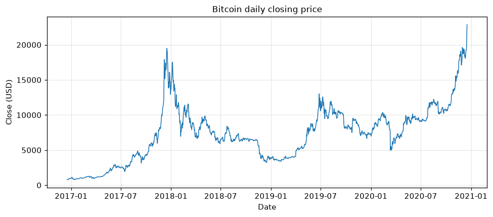
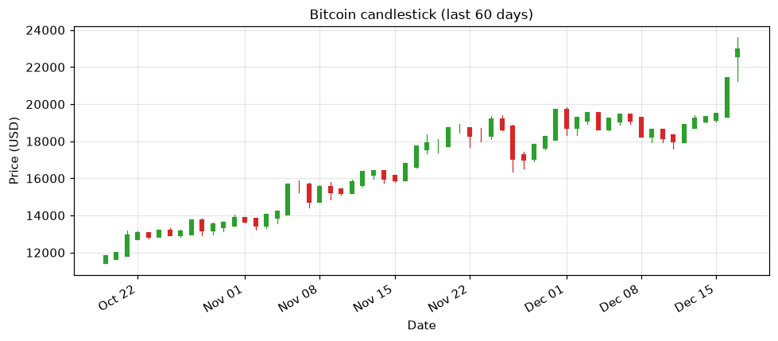

# Topic 1 — What is financial trading

> Notes compiled from the DataCamp video lecture (summary + slide content). Code is written in the
> course's idiom; the figures below are generated PNGs produced from the course CSVs (not the
> original slide images). Instructor: Chelsea Yang.

## Summary

Financial trading is the **buying and selling of financial assets** (a.k.a. financial securities).
Traders work across many instruments — **equities, bonds, forex, commodities, and cryptocurrencies**.
This course teaches **technical trading** in Python: exploring price data, building indicators and
signals, backtesting strategies, and evaluating performance.

## Key concepts

### Why people trade
- **Profit** through calculated risk:
  - **Long position** — buy low, sell high.
  - **Short position** — sell a borrowed asset high, buy it back lower.
- **Institutional traders** (hedge funds, investment banks) also trade to **hedge risk**, **provide
  liquidity**, or **rebalance portfolios**.

### Trading vs. investing
| | Trading | Investing |
|---|---|---|
| Time horizon | Days to months | Years to decades |
| Focus | Short-term trends & volatility | Fundamentals & macroeconomics |
| Positions | Long **and** short | Typically long only |

### Technical trading
Study **historical price patterns** and act on **indicators, signals, and predetermined rules** —
the approach used throughout this course.

## Financial time series data

Daily price data typically has **OHLCV** columns: Open, High, Low, Close, Volume — indexed by date.

```python
import pandas as pd
import matplotlib.pyplot as plt

# Load with the date column as a parsed DatetimeIndex
bitcoin_data = pd.read_csv('Bitcoin-price-data.csv', index_col='Date', parse_dates=True)
print(bitcoin_data.head())
```

## Code examples

### Line chart (time series)
```python
bitcoin_data['Close'].plot(title='Bitcoin daily closing price')
plt.show()
```

### Candlestick chart (plotly)
```python
import plotly.graph_objects as go

candlestick = go.Candlestick(
    x=bitcoin_data.index,
    open=bitcoin_data['Open'],
    high=bitcoin_data['High'],
    low=bitcoin_data['Low'],
    close=bitcoin_data['Close'])

fig = go.Figure(data=[candlestick])
fig.update_layout(title='Bitcoin prices')
fig.show()
```

## Figures

Generated from `course materials/data/Bitcoin-price-data.csv`.

**Line chart** — x-axis: date; y-axis: closing price. Shows the overall price trend over time.



**Candlestick chart** — each candle covers one period: the **body** spans open→close (green up / red
down) and the **wicks** reach the period's high and low. Conveys direction *and* intraperiod
volatility at a glance.



## Python tools used in the course
- **pandas** — data manipulation (`read_csv`, `parse_dates`, `.head()`).
- **matplotlib** — quick static plots (`.plot()`, `plt.show()`).
- **plotly** — interactive charts via `plotly.graph_objects` (`go.Candlestick`, `go.Figure`).