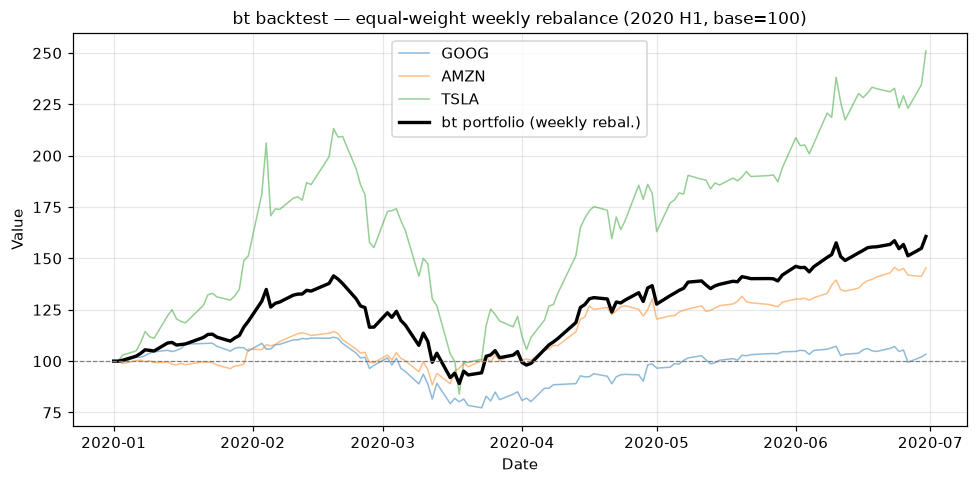

# Topic 2 — Financial trading with bt

> Notes compiled from the DataCamp video lecture (summary + slide content). Code is written in the
> course's idiom; the figures below are generated PNGs produced with **bt** from the course CSVs.

## Summary

**`bt`** is a flexible Python framework for **defining and backtesting** trading strategies. A
backtest applies a strategy to historical data to estimate how it *would* have performed.

## The bt process (4 steps)

1. **Get the data** — historical prices.
2. **Define the strategy** — a name plus a list of **algos** (task-focused operations).
3. **Backtest** — combine the strategy with the data.
4. **Evaluate** — inspect results and plots.

## Code examples

### 1. Get data
`bt.get` downloads **Adjusted Close** prices from Yahoo Finance by ticker(s):
```python
import bt

bt_data = bt.get('goog, amzn, tsla', start='2020-01-01', end='2020-06-30')
```

### 2. Define the strategy with algos
```python
bt_strategy = bt.Strategy('Trade_Weekly', [
    bt.algos.RunWeekly(),     # rebalance weekly
    bt.algos.SelectAll(),     # use all assets in the data
    bt.algos.WeighEqually(),  # equal allocation across assets
    bt.algos.Rebalance()      # apply the target weights
])
```

Common algos:
- `RunWeekly` / `RunMonthly` / `RunOnce` — **when** to trade.
- `SelectAll` — **what** data to use.
- `WeighEqually` — **how** to allocate.
- `Rebalance` — execute the weights.

### 3. Backtest
```python
bt_test = bt.Backtest(bt_strategy, bt_data)
bt_result = bt.run(bt_test)
```

### 4. Evaluate
```python
bt_result.plot(title='Backtest result')
```

## Figures

Backtested with **bt** (equal-weight, weekly rebalance of GOOG/AMZN/TSLA, 2020 H1, base = 100) on the
CSVs in `course materials/data/`.

**Portfolio value line chart** — x-axis: date; y-axis: value indexed to a **100** base. The thin
lines are the individual stocks; the bold black line is the `bt` equal-weight portfolio.

