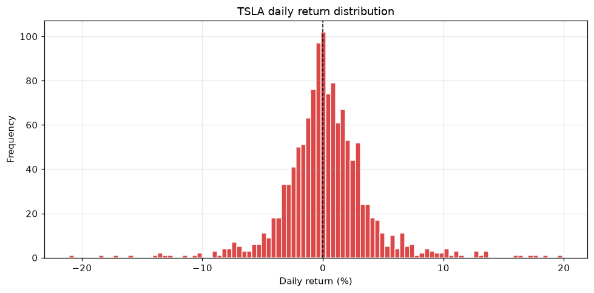

# Topic 2 — Getting familiar with your trading data

> Notes compiled from the DataCamp video lecture (summary + slide content). Code in the course's
> `pandas`/`talib` idiom; the figure below is a generated PNG produced from the course CSVs.

## Summary

How you explore price data depends on your **trading style / holding period**:

| Trader | Holding period |
|---|---|
| Day trader | Intraday (frequent trading) |
| Swing trader | Days to weeks |
| Position trader | Months to years |

To match a style you often **resample** the data to a coarser frequency, then study **returns**,
their **distribution**, and **moving averages**.

## Key techniques

### Resample
`resample()` converts between timeframes; downsampling aggregates with `mean`/`min`/`max`/`sum`.

```python
# 4-hour data -> daily mean
eurusd_daily = eurusd_4h.resample('D').mean()

# daily -> weekly mean
weekly = stock_data['Close'].resample('W').mean()
```

### Returns
`pct_change()` gives the percentage change between consecutive rows (daily returns on daily data).

```python
stock_data['daily_return'] = stock_data['Close'].pct_change() * 100
```

### Return histogram
`.hist(bins=...)` shows the distribution of returns; `bins` controls granularity.

```python
stock_data['daily_return'].hist(bins=100, color='red')
plt.xlabel('Daily return'); plt.ylabel('Frequency'); plt.show()
```

### Simple moving average
`.rolling(window).mean()` smooths price to reveal the trend.

```python
stock_data['sma_50'] = stock_data['Close'].rolling(50).mean()
```

## Figures

Generated from TSLA daily prices (`course materials/data/TSLA-stock-data.csv`).

**Return histogram** — the daily returns cluster near 0% with symmetric tails; wider spread means
higher volatility.


