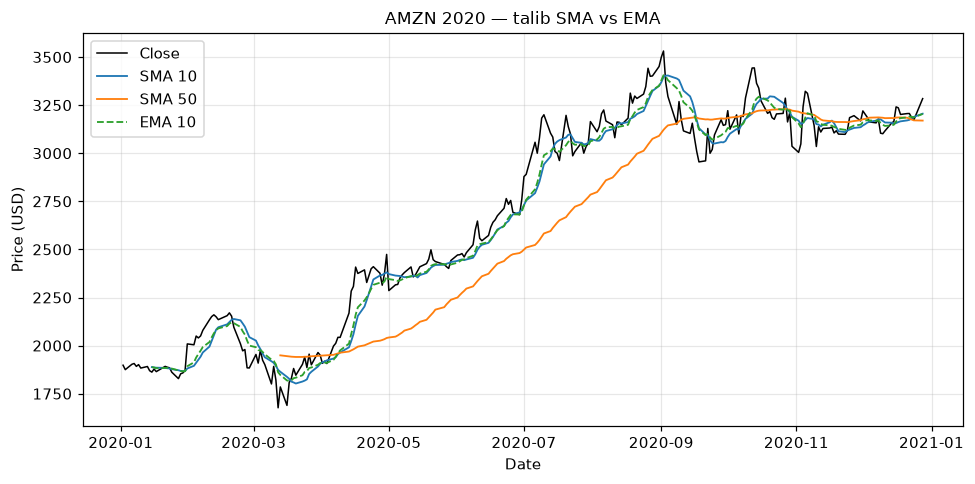

# Topic 1 — Trend indicator: Moving Averages (SMA & EMA)

> Notes compiled from the DataCamp video lecture (summary + slide content). Code in the course's
> `talib` idiom; the figures below are generated PNGs produced with **talib** on the course CSVs.

## Summary

**Technical indicators** are calculations based on price/volume used to construct signals and
strategies. Three main families appear in this course:
- **Trend** — moving averages (this topic).
- **Momentum** — RSI.
- **Volatility** — Bollinger Bands.

Moving averages smooth price to reveal the underlying **trend**.

## SMA vs. EMA

- **SMA (Simple Moving Average)** — the unweighted mean of the last *n* closes. Every period counts
  equally.
- **EMA (Exponential Moving Average)** — a weighted mean that gives **more weight to recent prices**,
  so it **reacts faster** to new information (and is a little noisier). SMA is smoother/slower.

The **`timeperiod`** (lookback) controls sensitivity: **shorter = more responsive**, **longer =
smoother** and less sensitive to short-term fluctuations.

## Code examples

```python
import talib

# Simple moving averages of the closing price
stock_data['SMA_short'] = talib.SMA(stock_data['Close'], timeperiod=10)
stock_data['SMA_long']  = talib.SMA(stock_data['Close'], timeperiod=50)

# Exponential moving averages
stock_data['EMA_short'] = talib.EMA(stock_data['Close'], timeperiod=10)
stock_data['EMA_long']  = talib.EMA(stock_data['Close'], timeperiod=50)

print(stock_data.tail())
```

Plotting price with its moving averages:
```python
import matplotlib.pyplot as plt

stock_data[['Close', 'SMA_short', 'SMA_long']].plot(title='SMA')
plt.show()
```

## Figures

Generated from AMZN 2020 closing prices (`course materials/data/AMZN-stock-data.csv`).

**Price + MA overlay** — the **short-period** MA hugs price and turns quickly; the **long-period** MA
lags and is smoother. The **EMA 10** (dashed) reacts a touch sooner than the **SMA 10**.

