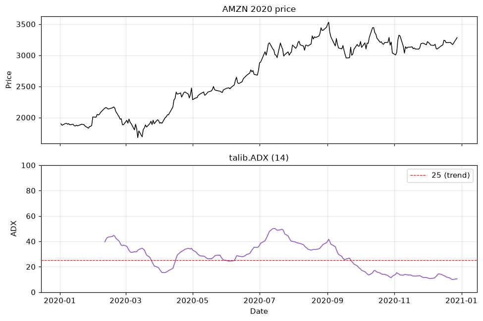

# Topic 2 — Strength indicator: ADX

> Notes compiled from the DataCamp video lecture (summary + slide content). Code in the course's
> `talib` idiom; the figures below are generated PNGs produced with **talib** on the course CSVs.

## Summary

**ADX (Average Directional Movement Index)** measures **trend strength** — not direction. Developed
by **J. Welles Wilder** ("New Concepts in Technical Trading Systems"). It ranges **0–100**.

## Reading the ADX

| ADX value | Interpretation |
|---|---|
| Below 25 | No clear trend (sideways / ranging market) |
| Above 25 | Trending |
| Above 50 | Strong trend |

ADX tells you **how strong** a move is, but **+DI / −DI** tell you the direction.

## Calculation (concept)

ADX is derived from two **directional indicators**:
- **+DI (plus DI)** — strength of upward movement.
- **−DI (minus DI)** — strength of downward movement.

ADX is a **smoothed average of the normalized difference** between +DI and −DI, computed from
**High, Low, Close** prices. Standard lookback: **14 periods**.

## Code examples

```python
import talib

# ADX needs High, Low, and Close
stock_data['ADX'] = talib.ADX(stock_data['High'],
                              stock_data['Low'],
                              stock_data['Close'],
                              timeperiod=14)
print(stock_data.tail())
```

Plot price and ADX on separate subplots (ADX has its own 0–100 scale):
```python
import matplotlib.pyplot as plt

fig, (ax1, ax2) = plt.subplots(2, 1, sharex=True)
ax1.plot(stock_data['Close'], label='Close')
ax1.set_title('Price')
ax2.plot(stock_data['ADX'], label='ADX')
ax2.axhline(25, color='red', linestyle='--')   # trend threshold
ax2.set_title('ADX')
plt.show()
```

## Figures

Generated from AMZN 2020 data (`course materials/data/AMZN-stock-data.csv`); ADX from **`talib.ADX`**.

**Two stacked subplots** sharing the date axis. Top: price. Bottom: ADX (0–100) with a dashed line at
**25**. ADX **rises during strong trends** and **falls when momentum weakens**.



## Parameter note
Longer `timeperiod` → smoother, less sensitive ADX; shorter → more responsive.