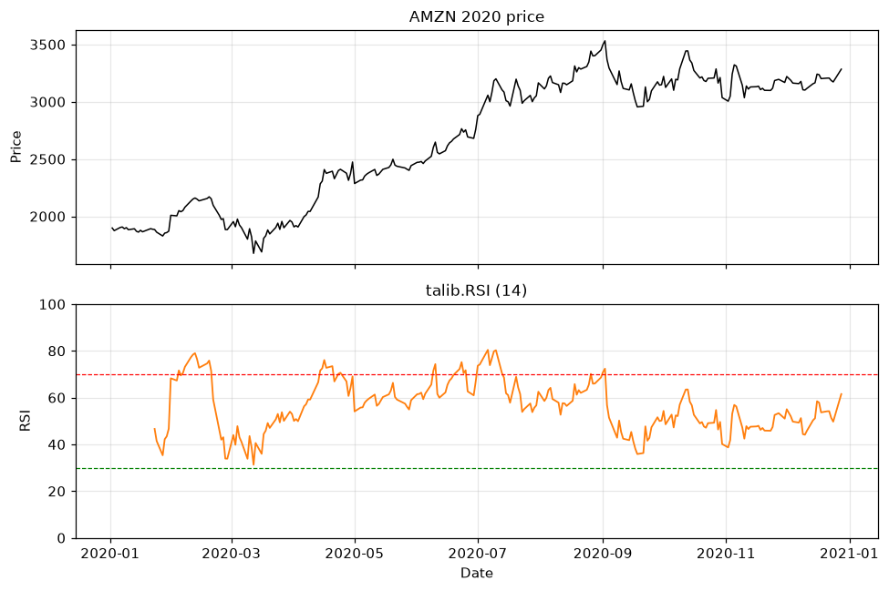

# Topic 3 — Momentum indicator: RSI

> Notes compiled from the DataCamp video lecture (summary + slide content). Code in the course's
> `talib` idiom; the figures below are generated PNGs produced with **talib** on the course CSVs.

## Summary

**RSI (Relative Strength Index)** is the most popular **momentum** indicator, also developed by
**J. Welles Wilder**. It ranges **0–100** and flags overbought/oversold conditions.

## Reading the RSI

| RSI value | Condition | Implication |
|---|---|---|
| Above 70 | Overbought | Potential pullback / reversal down |
| Below 30 | Oversold | Potential rally / reversal up |
| 30–70 | Neutral | No extreme |

## Calculation

Based on **Relative Strength (RS)** = average gain / average loss over *n* periods:

```
RSI = 100 − 100 / (1 + RS)
RS  = (average of up moves) / (average of down moves)   over n periods
```

The formula constrains RSI to 0–100. Standard lookback: **14 periods**; longer windows reduce
sensitivity.

## Code examples

```python
import talib

stock_data['RSI'] = talib.RSI(stock_data['Close'], timeperiod=14)
print(stock_data.tail())
```

Plot price above, RSI below, with 30/70 threshold lines:
```python
import matplotlib.pyplot as plt

fig, (ax1, ax2) = plt.subplots(2, 1, sharex=True)
ax1.plot(stock_data['Close'])
ax1.set_title('Price')
ax2.plot(stock_data['RSI'])
ax2.axhline(70, color='red', linestyle='--')    # overbought
ax2.axhline(30, color='green', linestyle='--')  # oversold
ax2.set_title('RSI')
plt.show()
```

## Figures

Generated from AMZN 2020 data (`course materials/data/AMZN-stock-data.csv`); RSI from **`talib.RSI`**.

**Two stacked subplots** (shared date axis). Bottom panel is RSI (0–100) with dashed lines at **30**
and **70**. RSI near **30** tends to align with price dips; near **70** with local peaks.

