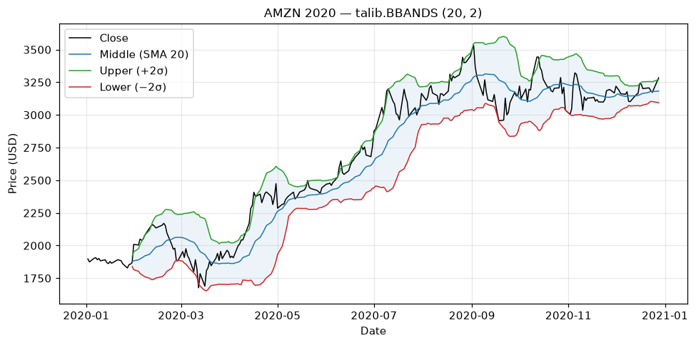

# Topic 4 — Volatility indicator: Bollinger Bands

> Notes compiled from the DataCamp video lecture (summary + slide content). Code in the course's
> `talib` idiom; the figures below are generated PNGs produced with **talib** on the course CSVs.

## Summary

**Bollinger Bands**, created by **John Bollinger** ("Bollinger on Bollinger Bands"), are a
**volatility** indicator built around a moving average with bands that expand and contract with
volatility.

## The three bands

- **Middle band** — an *n*-period **simple moving average** (default **n = 20**).
- **Upper band** — middle **+ k standard deviations** (default **k = 2**).
- **Lower band** — middle **− k standard deviations** (default **k = 2**).

```
Middle = SMA(Close, n)
Upper  = Middle + k · σ(Close, n)
Lower  = Middle − k · σ(Close, n)
```

## Interpretation

- **Wider bands = higher volatility**; narrower = calmer.
- With **k = 2**, the bands contain **~95%** of recent prices — price breaches them only ~5% of the
  time.
- Price near the **upper** band → relatively **expensive**; near the **lower** band → relatively
  **cheap**. Touches often precede a temporary reversal back toward the middle.

## Code examples

```python
import talib

upper, middle, lower = talib.BBANDS(stock_data['Close'],
                                    timeperiod=20,
                                    nbdevup=2,
                                    nbdevdn=2)

stock_data['UpperBand']  = upper
stock_data['MiddleBand'] = middle
stock_data['LowerBand']  = lower
```

Plot price with the three bands:
```python
import matplotlib.pyplot as plt

stock_data[['Close', 'UpperBand', 'MiddleBand', 'LowerBand']].plot(title='Bollinger Bands')
plt.show()
```

`talib.BBANDS` returns **three Series**: upper band, middle SMA, lower band.

## Figures

Generated from AMZN 2020 closing prices (`course materials/data/AMZN-stock-data.csv`).

**Price with band envelope** — the shaded channel **widens on big moves** and **narrows in quiet
periods**; price mostly stays inside, tagging the outer bands briefly before reverting.

