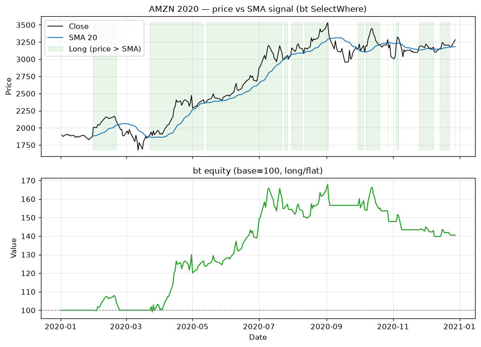

# Topic 1 — Trading signals

> Notes compiled from the DataCamp video lecture (summary + slide content). Code in the course's
> `bt`/`talib` idiom; the figures below are generated PNGs produced with **bt**/**talib** on the CSVs.

## Summary

**Trading signals** are **triggers to long (buy) or short (sell)** an asset based on **predetermined
criteria**. They can combine one or more technical indicators and **remove human emotion** from
decisions via an algorithmic approach.

## Example: price vs. SMA signal

- **Long entry** — price rises **above** the *n*-period SMA.
- **Exit** — price drops **below** the SMA.

## Building signals in bt

Two main approaches:
- **`SelectWhere`** — selects assets where a **boolean condition** (e.g. `price > SMA`) is True → go
  long those.
- **`WeighTarget`** — assign explicit target weights from a signal DataFrame (covered in later
  topics).

## Code examples

```python
import bt
import talib

# 1. Get price data
price_data = bt.get('aapl', start='2020-01-01', end='2020-12-31')

# 2. Calculate the SMA (rolling mean or talib.SMA)
sma = price_data.rolling(20).mean()

# 3. Define the strategy: long when price > SMA
bt_strategy = bt.Strategy('AboveSMA', [
    bt.algos.SelectWhere(price_data > sma),
    bt.algos.WeighEqually(),
    bt.algos.Rebalance()
])

# 4. Backtest and evaluate
bt_backtest = bt.Backtest(bt_strategy, price_data)
bt_result = bt.run(bt_backtest)
bt_result.plot(title='Price > SMA signal')
```

## Real-world simplifications (noted in the lecture)

For teaching, the examples **ignore**:
- Multiple assets (single-asset only).
- **Slippage and commissions**.
- Cross-asset correlations.

## Figures

Backtested with **bt** (`SelectWhere`) on AMZN 2020 (`course materials/data/AMZN-stock-data.csv`),
long when price > SMA 20.

**Top:** price vs SMA 20 with the **long** regions shaded green. **Bottom:** the long/flat equity
curve (base = 100) — flat while out of the market, rising while holding.

