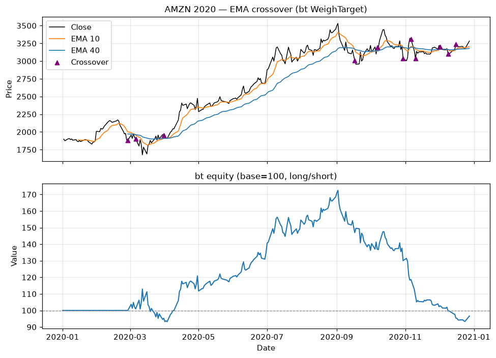

# Topic 2 — Trend-following strategies

> Notes compiled from the DataCamp video lecture (summary + slide content). Code in the course's
> `bt`/`talib` idiom; the figures below are generated PNGs produced with **bt**/**talib** on the CSVs.

## Summary

**Trend-following (momentum)** strategies bet that a price move **persists** in its current
direction — "the trend is your friend." Contrast with **mean reversion**, which bets prices revert
to an average after extremes.

## MA crossover

Use a **short** and a **long** EMA. Signals come from their **crossovers**:

| Condition | Signal | Meaning |
|---|---|---|
| Short EMA **crosses above** long EMA | **+1** | Go long (uptrend) |
| Short EMA **crosses below** long EMA | **−1** | Go short (downtrend) |
| Not enough data (warm-up) | **0** | No position |

## Code examples

```python
import bt
import talib

price_data = bt.get('aapl', start='2020-01-01', end='2020-12-31')

# Short and long EMAs
EMA_short = talib.EMA(price_data['aapl'], timeperiod=10).to_frame()
EMA_long  = talib.EMA(price_data['aapl'], timeperiod=40).to_frame()

# Build the signal
signal = EMA_long.copy()
signal[EMA_short > EMA_long] = 1     # long
signal[EMA_short < EMA_long] = -1    # short
signal[EMA_long.isnull()]    = 0     # warm-up: no position

# WeighTarget turns the signal into target positions
bt_strategy = bt.Strategy('EMA_crossover', [
    bt.algos.WeighTarget(signal),
    bt.algos.Rebalance()
])

bt_backtest = bt.Backtest(bt_strategy, price_data)
bt_result = bt.run(bt_backtest)
bt_result.plot(title='EMA crossover (trend following)')
```

## Figures

Backtested with **bt** (`WeighTarget`) on AMZN 2020 (`course materials/data/AMZN-stock-data.csv`),
EMA 10 vs EMA 40.

**Top:** price with EMA 10 / EMA 40 and crossover markers. **Bottom:** the long/short equity curve
(base = 100).

