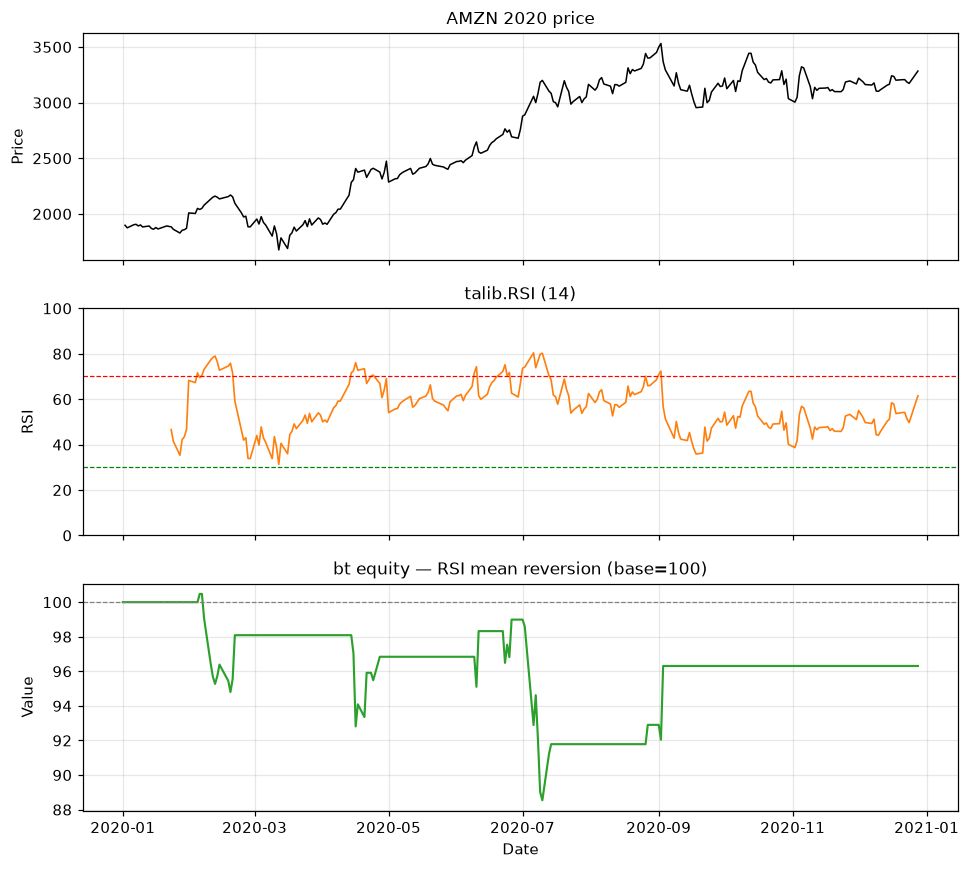

# Topic 3 — Mean reversion strategy

> Notes compiled from the DataCamp video lecture (summary + slide content). Code in the course's
> `bt`/`talib` idiom; the figures below are generated PNGs produced with **bt**/**talib** on the CSVs.

## Summary

A **mean reversion** strategy assumes prices **revert to an average** after reaching extremes —
"buy the fear, sell the greed" / **"buy the dip, sell the peak."** Here the extremes are detected
with **RSI**.

## RSI-based signal

| RSI | Condition | Signal |
|---|---|---|
| **< 30** | Oversold | **+1** (long) |
| **> 70** | Overbought | **−1** (short) |
| 30–70 | Neutral | **0** (no position) |

## Implementation steps

1. Calculate RSI with `talib`.
2. Convert to a DataFrame.
3. Build signals from the 30/70 thresholds.
4. Visualize signals with price (RSI uses a separate 0–100 scale).
5. Apply signals via a weighting algo.
6. Backtest and evaluate.

## Code examples

```python
import bt
import talib

price_data = bt.get('aapl', start='2020-01-01', end='2020-12-31')

# RSI as a DataFrame
stock_rsi = talib.RSI(price_data['aapl']).to_frame()

# Build the mean-reversion signal
signal = stock_rsi.copy()
signal[stock_rsi > 70] = -1                          # overbought -> short
signal[stock_rsi < 30] = 1                           # oversold   -> long
signal[(stock_rsi <= 70) & (stock_rsi >= 30)] = 0    # neutral    -> flat

# Apply and backtest
bt_strategy = bt.Strategy('RSI_MeanReversion', [
    bt.algos.WeighTarget(signal),
    bt.algos.Rebalance()
])

bt_backtest = bt.Backtest(bt_strategy, price_data)
bt_result = bt.run(bt_backtest)
bt_result.plot(title='RSI mean reversion')
```

## Performance characteristics

- **Higher trading frequency** than trend following — it repeatedly fades short-term extremes.
- Profit is **flat during neutral (non-signal) periods**. Historical backtests show profitability.

## Figures

Backtested with **bt** (`WeighTarget`) on AMZN 2020 (`course materials/data/AMZN-stock-data.csv`)
using the RSI 30/70 thresholds.

**Three panels:** price, RSI (14) with 30/70 lines, and the resulting mean-reversion equity curve
(base = 100).

