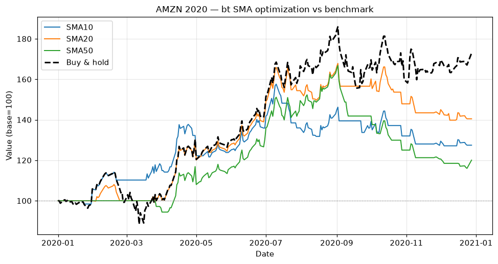

# Topic 4 — Strategy optimization and benchmarking

> Notes compiled from the DataCamp video lecture (summary + slide content). Code in the course's
> `bt` idiom; the figures below are generated PNGs produced with **bt** on the course CSVs.

## Summary

- **Optimization** — test a **range of input parameter values** to find the ones that give better
  performance (e.g. which SMA lookback: 10, 20, 50…).
- **Benchmarking** — compare a strategy against a **standard reference** (e.g. buy-and-hold, S&P 500,
  Treasuries).

## Optimization — reusable function

Wrap the strategy in a function so you can call it with different parameters:

```python
import bt

def signal_strategy(ticker, period, name,
                    start='2020-01-01', end='2020-12-31'):
    price_data = bt.get(ticker, start=start, end=end)
    sma = price_data.rolling(period).mean()
    bt_strategy = bt.Strategy(name, [
        bt.algos.SelectWhere(price_data > sma),
        bt.algos.WeighEqually(),
        bt.algos.Rebalance()
    ])
    return bt.Backtest(bt_strategy, price_data)

# Test several SMA lookbacks
sma10 = signal_strategy('aapl', 10, 'SMA10')
sma20 = signal_strategy('aapl', 20, 'SMA20')
sma50 = signal_strategy('aapl', 50, 'SMA50')

bt_results = bt.run(sma10, sma20, sma50)
bt_results.plot(title='Strategy optimization')
```

In the lecture's example, the **20-period SMA** gave the best performance.

## Benchmarking — buy-and-hold baseline

Use **`RunOnce`** to buy at the start and hold (passive), then compare:

```python
def buy_and_hold(ticker, name, start='2020-01-01', end='2020-12-31'):
    price_data = bt.get(ticker, start=start, end=end)
    bt_strategy = bt.Strategy(name, [
        bt.algos.RunOnce(),
        bt.algos.SelectAll(),
        bt.algos.WeighEqually(),
        bt.algos.Rebalance()
    ])
    return bt.Backtest(bt_strategy, price_data)

benchmark = buy_and_hold('aapl', name='benchmark')

bt_results = bt.run(sma20, benchmark)
bt_results.plot(title='Strategy vs. benchmark')
```

## Benchmark examples
- **Buy-and-hold** vs. active trading.
- **S&P 500** for U.S. equities.
- **U.S. Treasuries** for bond/risk reference.

## Figures

Backtested with **bt** on AMZN 2020 (`course materials/data/AMZN-stock-data.csv`): SMA 10/20/50
(`SelectWhere`) signal strategies plus a `RunOnce` buy-and-hold benchmark.

**Multi-line comparison** (all indexed to 100) — one line per SMA lookback, with the buy-and-hold
benchmark dashed in black for reference.

