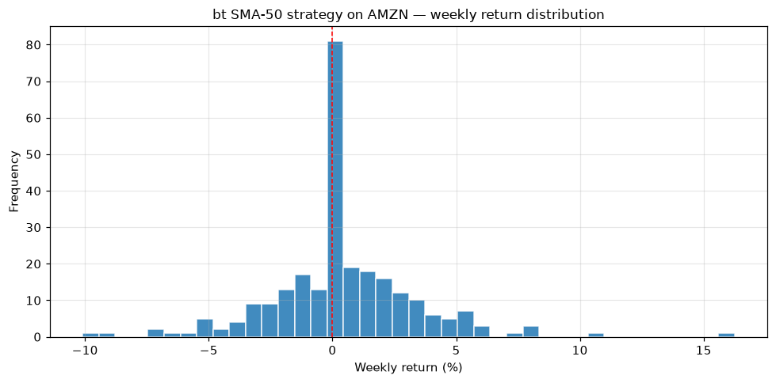

# Topic 1 — Strategy return analysis

> Notes compiled from the DataCamp video lecture (summary + slide content). Code in the course's
> `bt` idiom; the figures below are generated PNGs produced with **bt** on the course CSVs.

## Summary

After a backtest, evaluate it with **return statistics**. `bt` exposes a rich set of metrics via
`bt_result.stats`, plus helpers to plot return histograms and compare strategies.

## Backtest statistics

```python
# Full stats table (a DataFrame; metrics are the row index)
resInfo = bt_result.stats
print(resInfo.index)          # list of available metric names

# Return metrics at different frequencies
print(resInfo.loc['daily_mean'])
print(resInfo.loc['monthly_mean'])
print(resInfo.loc['yearly_mean'])
```

## CAGR — Compound Annual Growth Rate

The **annualized** growth rate that would take the starting value to the ending value:

```
CAGR = (Ending value / Beginning value) ** (1 / years) − 1
```

```python
print('CAGR: {:.2%}'.format(resInfo.loc['cagr']))
```

## Return histograms

```python
# Distribution of returns; freq: 'd' daily, 'w' weekly, 'm' monthly
bt_result.plot_histograms(bins=50, freq='w')
```

## Comparing multiple strategies

```python
bt_results = bt.run(strategy1_backtest, strategy2_backtest)
bt_results.plot(title='Strategy comparison')
bt_results.display()                    # side-by-side stats table
lookback = bt_results.display_lookback_returns()
```

## Figures

Backtested with **bt**: an SMA-50 signal strategy (`SelectWhere`) on AMZN over the full 2016–2020
range (`course materials/data/AMZN-stock-data.csv`).

**Return histogram** — x-axis: weekly return bucket; y-axis: frequency. The spread clusters near zero
(many small weeks) with tails for the larger up/down weeks; the dashed line marks 0%.

