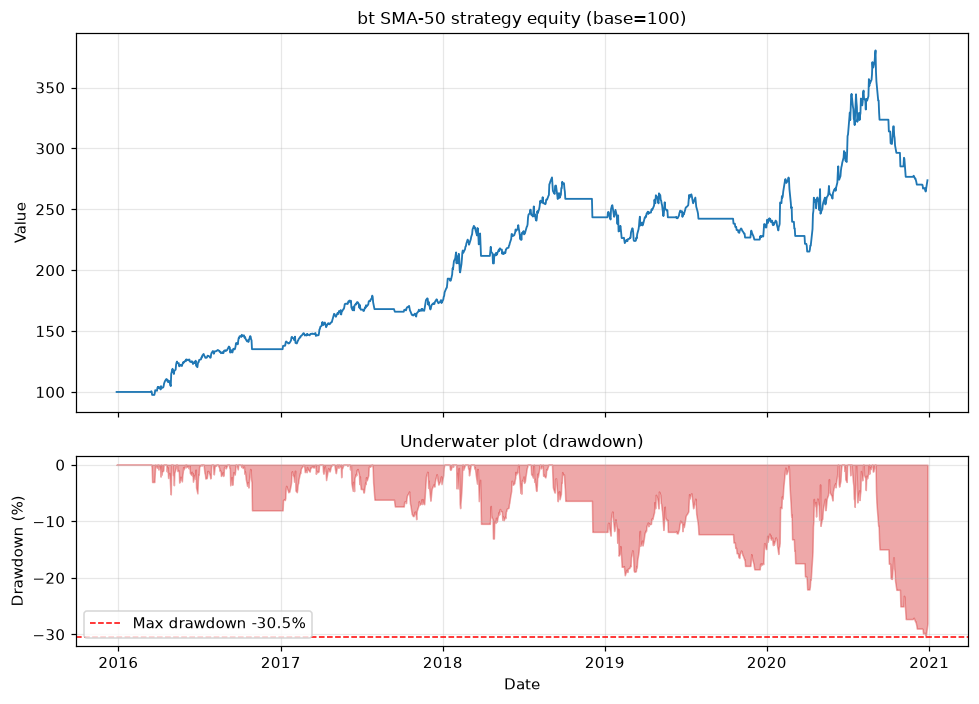

# Topic 2 — Drawdown (and the Calmar ratio)

> Notes compiled from the DataCamp video lecture (summary + slide content). Code in the course's
> `bt` idiom; the figures below are generated PNGs produced with **bt** on the course CSVs.

## Summary

A **drawdown** is a **peak-to-trough decline** over a period for an asset or account, expressed as a
percentage. It measures **downside risk**. Example: $1,000 → $900 is a **10% drawdown**.

## Maximum drawdown

The **largest** peak-to-trough drop before a new peak:

```
Max Drawdown = (Peak value − Trough value) / Peak value
```

**Worked example:** start $1,000, peak **$1,700** (A), fall to **$800** (D), later recover to $2,000
(E):
```
($1,700 − $800) / $1,700 ≈ 53% max drawdown
```

## Drawdown metrics from a backtest

`bt_result.stats` provides:
- **`max_drawdown`** — worst peak-to-trough loss.
- **Average drawdown** — mean drawdown percentage over the period.
- **Average drawdown days** — typical duration spent in drawdown.

```python
resInfo = bt_result.stats
print('Max Drawdown: {:.2%}'.format(resInfo.loc['max_drawdown']))
```

## Calmar ratio

Risk-adjusted return relating growth to worst drawdown. Created by **Terry Young (1991)** — the name
stands for **CAL**ifornia **M**anaged **A**ccounts **R**eport.

```
Calmar Ratio = CAGR / |Max Drawdown|
```

- **Higher is better.** A Calmar ratio **above 3** is considered excellent.

```python
# Manual calculation (max_drawdown is negative, so take absolute value)
calmar = resInfo.loc['cagr'] / abs(resInfo.loc['max_drawdown'])
print('Calmar Ratio (manual): {:.2f}'.format(calmar))

# Or read it directly from the stats
print('Calmar Ratio: {:.2f}'.format(resInfo.loc['calmar']))
```

## Figures

Backtested with **bt**: SMA-50 strategy on AMZN, full 2016–2020 range
(`course materials/data/AMZN-stock-data.csv`).

**Top:** the equity curve (base = 100). **Bottom:** the **underwater plot** — percent below the
running peak, dipping to the **max drawdown** (dashed red) at the deepest trough and returning to 0
at each new high.

