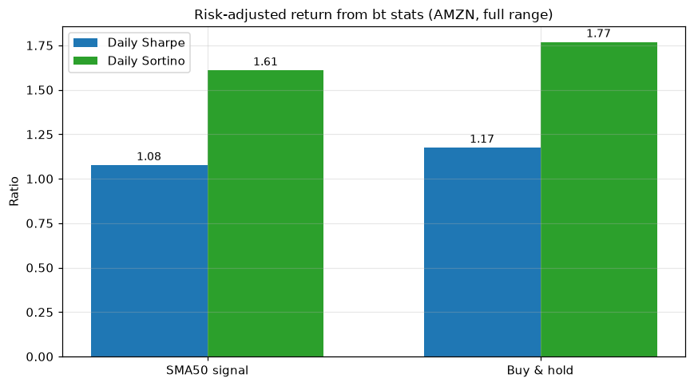

# Topic 3 — Sharpe ratio and Sortino ratio

> Notes compiled from the DataCamp video lecture (summary + slide content). Code in the course's
> `bt` idiom; the figure below is a generated PNG produced from real **bt** backtest stats.

## Summary

Bigger returns aren't automatically better once you account for **risk**. These two **risk-adjusted**
metrics measure return **per unit of risk**.

## Sharpe ratio

Developed by Nobel laureate **William F. Sharpe**. Excess return over the risk-free rate, divided by
the **standard deviation of returns**:

```
Sharpe = (R_portfolio − R_riskfree) / σ_portfolio
```

- In a low-rate environment the **risk-free rate ≈ 0**.
- **Higher Sharpe = more attractive** risk-adjusted return.

**Example:**
| Strategy | Return | Volatility | Sharpe |
|---|---|---|---|
| 1 | 15% | 30% | **0.5** |
| 2 | 10% | 8% | **1.25** |

Strategy 2 wins on a risk-adjusted basis despite the lower raw return.

## Sortino ratio

Same idea, but divides by **downside deviation** (volatility of **negative** returns only) instead of
total volatility:

```
Sortino = (R_portfolio − R_riskfree) / σ_downside
```

This avoids penalizing a strategy for **upside** volatility, giving a fairer view of harmful risk.

## Code examples

```python
resInfo = bt_result.stats

# Available at daily / monthly / yearly frequencies
print('Daily Sharpe:  {:.2f}'.format(resInfo.loc['daily_sharpe']))
print('Daily Sortino: {:.2f}'.format(resInfo.loc['daily_sortino']))

print('Yearly Sharpe:  {:.2f}'.format(resInfo.loc['yearly_sharpe']))
print('Yearly Sortino: {:.2f}'.format(resInfo.loc['yearly_sortino']))
```

## Figures

Computed from real **bt** backtest stats on AMZN (full range): an SMA-50 signal strategy vs a
buy-and-hold benchmark. (The 15%/10% example in the table above is the lecture's illustration.)

**Grouped bars** — each strategy's **daily Sharpe** and **daily Sortino** (from `bt_result.stats`).
Sortino sits above Sharpe for both, because it penalizes only downside volatility.

